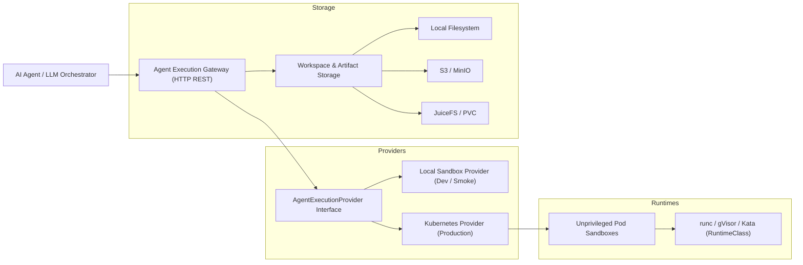

# Partners

> A provider-agnostic, secure, and Kubernetes-native execution gateway and sandbox infrastructure for AI agents.

[](https://github.com/limmytian/partners/actions/workflows/ci.yml)
[](LICENSE)
[](package.json)

---

## Overview

**Partners** is a high-performance execution gateway and agent sandbox control plane designed for autonomous AI software engineers (SWE agents), code interpreters, and AI coding assistants.

Running untrusted agent-generated code safely and statefully in production is hard. Partners solves this by providing:
- **One-shot interpreter jobs**: Fast, ephemeral execution for short-lived scripts and CLI commands.
- **Durable workspace sessions**: Stateful environments supporting Git checkout, multi-file editing, test running, debugging, and artifact indexing.
- **Enterprise-grade isolation**: Kubernetes-native sandboxing with unprivileged Pods, NetworkPolicies, and optional sandboxed container runtimes (such as [gVisor](https://gvisor.dev/) or [Kata Containers](https://katacontainers.io/)).
- **Pluggable storage boundaries**: Workspaces and artifacts seamlessly backed by local disks, S3-compatible object stores, or distributed file systems (like PVC-backed JuiceFS).
- **Production reliability**: Built-in HTTP idempotency replay, scoped service-token RBAC, Prometheus metrics, and live cancellation propagation.

---

## Architecture



---

## Quick Start (5 Minutes)

You can run a complete local stack (Gateway, Admin Console, PostgreSQL store, and MinIO S3 artifact storage) using Docker Compose in under five minutes.

### 1. Start the stack

```bash
git clone https://github.com/limmytian/partners.git
cd partners

docker compose -f docker-compose.gateway-smoke.yml up -d --build
```

- **Gateway API**: `http://localhost:18080`
- **Admin Console**: `http://localhost:13000`
- **MinIO Console**: `http://localhost:19001` (User: `partners`, Password: `partners-secret`)

### 2. Run a One-Shot Code Execution Job

Submit an ephemeral Python interpreter job through the Gateway REST API:

```bash
curl -X POST http://localhost:18080/v1/jobs \
  -H "Content-Type: application/json" \
  -H "Authorization: Bearer local-dev-token" \
  -H "X-Partners-Tenant-Id: local" \
  -H "X-Partners-Project-Id: partners" \
  -d '{
    "executionMode": "ephemeral_interpreter",
    "command": {
      "argv": ["python3", "-c", "import sys; print(f\"Hello from Partners Sandbox! Python {sys.version}\")"]
    },
    "timeoutSeconds": 30
  }'
```

### 3. Check Job Status and Output

```bash
# Query job status using the returned job ID
curl http://localhost:18080/v1/jobs/<JOB_ID> \
  -H "Authorization: Bearer local-dev-token" \
  -H "X-Partners-Tenant-Id: local"
```

### 4. Stop the stack

```bash
docker compose -f docker-compose.gateway-smoke.yml down -v
```

---

## Key Features

### 1. Kubernetes-Native & Sandbox Security
- **No privileged containers required**: Sandboxes run as standard unprivileged Pods with root filesystem restrictions and dropped capabilities.
- **RuntimeClass support**: Seamlessly enforce kernel-level isolation through gVisor (`runsc`) or Kata Containers by configuring `PARTNERS_K8S_RUNTIME_CLASS`.
- **Egress & Ingress control**: Out-of-the-box Kubernetes `NetworkPolicy` profiles to restrict unauthorized network access.

### 2. Stateful Workspace Sessions
- Run iterative development loops inside long-lived agent sessions.
- Automatically handles Git credential injection without leaking secrets into logs or artifacts.
- Supports persistent volumes (JuiceFS CSI) allowing workspace state recovery across Pod recreation.

### 3. Enterprise Operations
- **Idempotency Protection**: Every `POST /v1/jobs` request accepts an `Idempotency-Key` header with atomic replay caching.
- **Prometheus Observability**: Pre-built metric instrumentation for job durations, pool saturations, success/failure rates, and storage latencies.
- **Admin Console**: Built-in dashboard for monitoring active sessions, inspecting job timelines, and analyzing operational metrics.

---

## Local Development & Testing

Partners has zero runtime framework lock-in and minimal external dependencies.

```bash
# Install dependencies
npm ci

# Run entire test suite (80+ unit and integration tests)
npm test

# Run local end-to-end smoke test suite
docker compose -f docker-compose.gateway-smoke.yml up -d --build
SMOKE_CHECK_DEPENDENCIES=1 \
SMOKE_EXPECT_ARTIFACT_BACKEND=s3 \
SMOKE_RESTART_COMMAND="docker compose -f docker-compose.gateway-smoke.yml restart gateway" \
  npm run gateway:smoke
docker compose -f docker-compose.gateway-smoke.yml down -v
```

---

## Documentation Index

- [OpenAPI Specification](openapi/agent-execution-gateway.v1.yaml)
- [Agent Execution Gateway API Guide](docs/gateway-api.md)
- [Kubernetes Sandbox Provider Guide](docs/kubernetes-sandbox-provider.md)
- [Provider Comparison Matrix](docs/provider-comparison.md)
- [Admin Console Architecture & Runbook](docs/admin-console.md)
- [Ephemeral Interpreter Jobs Specification](docs/ephemeral-interpreter-jobs.md)
- [Repository Workspace Persistence & Artifacts](docs/workspace-persistence-and-artifacts.md)
- [Scoped Git Credential Flow](docs/git-credential-flow.md)
- [Gateway Operations Runbook](docs/gateway-operations.md)
- [Gateway Observability & Metrics Contract](docs/gateway-observability.md)

---

## Contributing

We welcome issues and pull requests! Please review our [Contributing Guide](CONTRIBUTING.md) and [Code of Conduct](CODE_OF_CONDUCT.md) before submitting.

---

## License

This project is licensed under the [Apache License 2.0](LICENSE).
