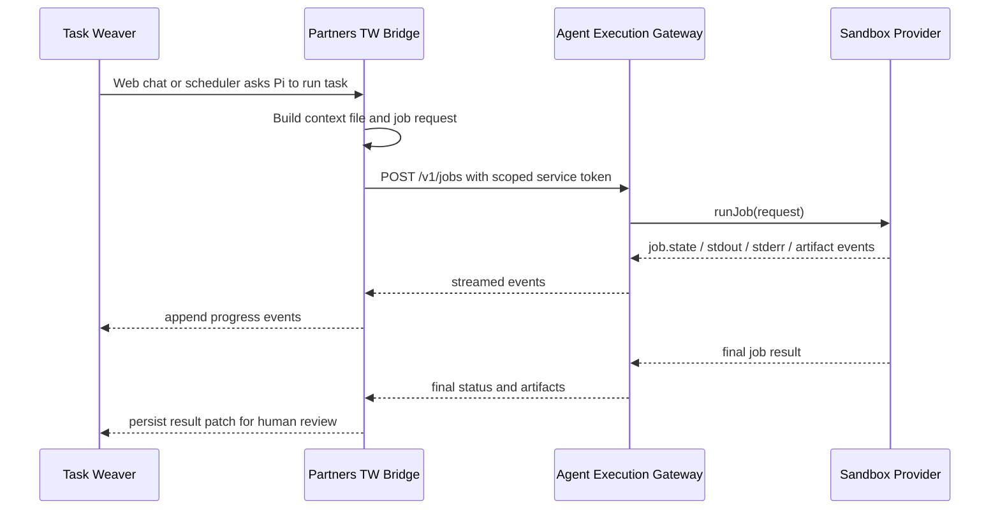

# Task Weaver Server-Side Agent Integration

This document defines the first consumer integration for Partners: Task Weaver server-side Pi agent execution.

## Scope

In scope:

- web chat initiated server-side agent jobs
- scheduler-driven server-side agent jobs
- sandbox job API request mapping
- streamed lifecycle/log/artifact events back to Task Weaver
- persisted result payloads for human review
- scoped gateway service token references

Out of scope:

- local daemon workers
- direct runtime-provider SDK use from Task Weaver
- production JuiceFS storage validation
- broad user or organization Git credentials

## Flow



## Request Mapping

Task Weaver context becomes a sandbox input file at `/workspace/.task-weaver/context.json`. The file carries only execution context:

- Task Weaver project, requirement, task, conversation, or scheduler run IDs
- source: `web_chat` or `scheduler`
- actor metadata for audit
- prompt/instructions
- optional repository target

The gateway job request carries:

- `executionMode`: `workspace_session` when an existing session is supplied, otherwise `ephemeral_interpreter`
- `tenantId` and `projectId`: Task Weaver scoped identifiers
- `credentialRefs`: credential grant IDs, not raw tokens
- `metadata.taskWeaver`: IDs used to map events and final results back to Task Weaver
- `artifactPolicy`: stdout/stderr plus declared workspace artifact paths
- `network`: allowlist mode with repository host and caller-supplied dependency hosts

## Scoped Service Token

Task Weaver should call the gateway through a service token that is scoped to:

- `jobs:create`
- `jobs:read`
- `artifacts:read`

Cancellation can add `jobs:cancel` for interactive flows. The bridge stores a token reference such as `secret://tw/gateway-service-token`; raw bearer tokens should not be present in Task Weaver documents, job metadata, or sandbox input files.

## Retry and Idempotency

Task Weaver should set `Idempotency-Key` on every `POST /v1/jobs` call that may
be retried by a web request, scheduler, daemon, or queue worker. A recommended
shape is:

```text
tw-task:{taskId}:run:{attempt}
```

Use the same key when retrying the same logical submission after a timeout,
network disconnect, or `5xx` response where the caller cannot determine whether
the gateway accepted the job. Use a new key for a deliberate new attempt with a
different command, context payload, timeout, or repository input.

Gateway replay semantics are stable for 24 hours by default:

- same key, tenant/project scope, and normalized request body: returns the
  original `202` accepted job response without starting another provider job
- same key and tenant/project scope but a different normalized request body:
  returns `409 Conflict`
- same external key in a different tenant or project scope: treated as an
  independent submission

Task Weaver should treat `409 Conflict` as a caller bug or stale retry payload,
not as a transient gateway failure. The idempotency hash redacts secret-shaped
fields before hashing, so raw credentials must not be embedded in job metadata
or retry diagnostics.

## Event Mapping

| Gateway event | Task Weaver update |
| --- | --- |
| `job.state` | execution status update |
| `log.stdout` / `log.stderr` | streamed log entry |
| `artifact.created` | artifact reference for review |
| `job.final` | terminal execution summary |
| unknown event | generic diagnostic event |

Task Weaver should keep the stream append-only. The final result patch links the gateway job ID, terminal state, exit code, artifacts, and a review status. Successful sandbox execution should normally move the Task Weaver task to `in_review`, not directly to `done`, because humans may need to inspect changes, artifacts, or pull request metadata.

## Result Persistence

The bridge persists a final payload containing:

- Task Weaver task and requirement IDs
- gateway job ID and provider
- terminal state and exit code
- artifact summaries
- review-required task status
- sanitized metadata

If publishing fails after code edits, the result should still include logs and patch artifacts so Task Weaver can present a recovery path.

## Prototype

The current prototype is implemented in `src/integrations/task-weaver-agent.js`. Tests run the bridge through `LocalSandboxProvider`, which validates request construction, event streaming, artifact collection, and result persistence without needing a live Task Weaver server or Kubernetes sandbox runtime.
