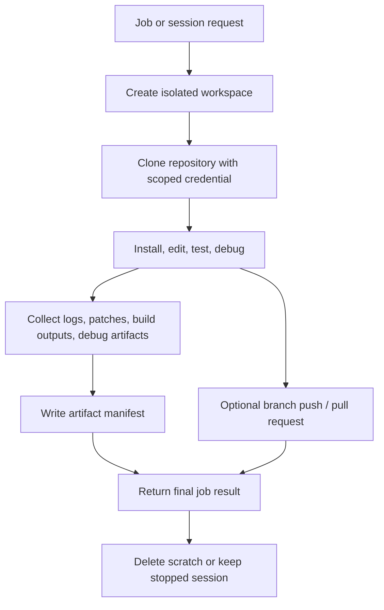

# Repository Workspace Persistence and Artifacts

This document defines how Partners treats repository workspaces across local, object-store, and PVC-backed JuiceFS storage.

Reviewed on: 2026-08-13

## Decision

Repository sandboxes should not expose a shared mutable workspace as the control-plane contract. Each run receives an isolated workspace, and the gateway returns durable outputs through an artifact manifest.

JuiceFS is validated for isolated single-node staging sessions, but the control-plane contract does not depend on a shared mutable workspace. The current system supports:

- fresh clones for one-shot jobs
- reusable Kubernetes sessions for interactive workspace agents
- object-store or local artifact manifests
- optional runtime image layers or storage caches for dependencies
- branch push or pull request metadata as the durable publishing path

Multi-node JuiceFS qualification is required before we promise node-loss workspace continuity or production-grade shared cache semantics.

## Workspace State Classes

| Class | Lifetime | Storage owner | Retrieval path | Notes |
| --- | --- | --- | --- | --- |
| Ephemeral scratch | One job | Provider sandbox | Not directly retrieved | Deleted after the job. Use for one-shot interpreter jobs and fresh repository tasks. |
| Session workspace | Session TTL | Kubernetes Pod and optional PVC | Gateway session APIs | Used for interactive debugging. PVC-backed sessions can survive Pod replacement, but are still not the source of truth for published source changes. |
| Durable artifacts | Retention policy | Gateway artifact store | Artifact manifest URIs | Logs, patches, diffs, test reports, build outputs, debug bundles, and metadata. This is the stable retrieval contract. |
| Git branch / pull request | Until repo policy deletes it | Git provider | Git remote / PR URL | The durable publishing path for source changes. |
| Snapshot/cache | Provider or storage backend | Provider/storage | Internal reference only | Optional acceleration for dependencies and common tooling. Never required to retrieve user results. |

## Lifecycle

## Artifact Manifest Contract

Every completed job should be able to return a manifest with:

- `workspaceId`, `jobId`, and optional `sessionId`
- `createdAt` and `retentionClass`
- artifact entries with `kind`, `name`, `workspaceUri`, `storageUri`, `contentType`, `sizeBytes`, and optional `checksum`
- Git publishing metadata such as source branch, target branch, commit SHA, and pull request URL when present
- no raw credentials, environment secrets, or provider-private sandbox handles

Recommended artifact kinds:

| Kind | Examples | Default retention |
| --- | --- | --- |
| `log` | stdout, stderr, command traces | `review` |
| `patch` | unified diff, format-patch output | `review` |
| `branch_ref` | pushed branch and commit SHA metadata | `audit` |
| `build_output` | compiled assets, screenshots, coverage reports | `review` |
| `debug_bundle` | core dumps, traces, repro archives | `transient` unless promoted |
| `metadata` | timings, resource usage, provider IDs after redaction | `audit` |

## Retrieval Strategy

The gateway should treat `workspace:/...` paths as sandbox-local references and `artifact://...`, `object://...`, or signed object URLs as durable retrieval references. External services should retrieve only durable artifacts, not provider workspace paths.

In development, the `LocalArtifactStore` writes artifact payloads to a gateway-owned filesystem directory and exposes `artifact://local/<artifactId>` handles. It intentionally omits provider-local and gateway-local paths from public manifests. In hosted environments, the same manifest points to object storage or a signed download handle. PVC-backed JuiceFS session storage preserves the workspace across Pod replacement without changing the public artifact manifest shape.

## Cleanup and Retention

| Retention class | Suggested TTL | Use |
| --- | --- | --- |
| `transient` | 1-24 hours | Debug bundles and oversized diagnostics. |
| `review` | 7-30 days | Logs, patches, test reports, and build outputs for normal review. |
| `release` | Release policy | Published build outputs and user-requested retained artifacts. |
| `audit` | Compliance policy | Job metadata, credential grant IDs, branch refs, and PR metadata. |

Deletion must be driven by artifact retention, not workspace lifetime. A job may delete its sandbox immediately after completion while preserving the manifest and artifacts.

## Production Gate

The isolated single-node staging validation is complete: distinct sessions used distinct PVC paths, data survived Pod replacement and gateway rollback, and PVC deletion cleaned up the associated PV through the project-scoped StorageClass.

Production admission still requires:

- multi-node scheduling and node-loss/remount validation
- cache freshness, backup/restore, and long-running workload measurements
- production SLOs for Git, dependency installation, and artifact operations

See [Partners JuiceFS workspace validation](slices/2026-08-13-juicefs-validation.md) for the completed staging evidence.
